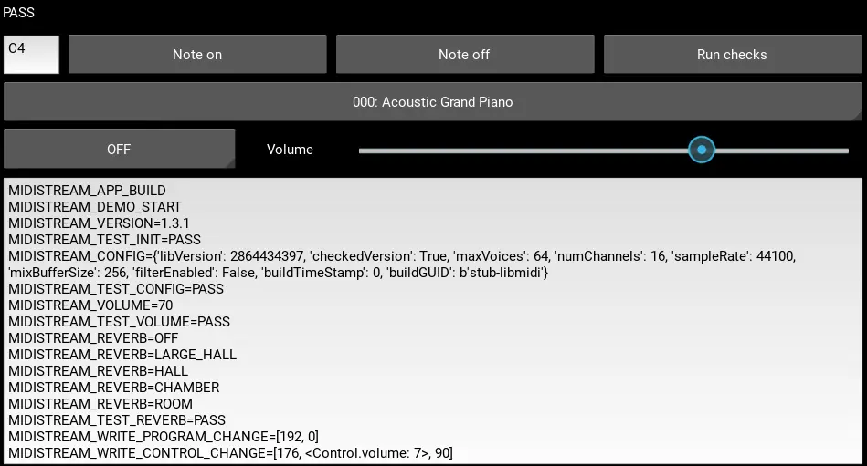

Midistream Demo
===============

This Kivy/Android demo app shows how to use midistream in a project.

Build and run manually::

  cd examples/demo
  buildozer android debug deploy run logcat

The app prints log markers to verify that MIDI functionality works as expected.

Expected success marker::

  MIDISTREAM_DEMO_PASS

Expected failure marker::

  MIDISTREAM_DEMO_FAIL ...
